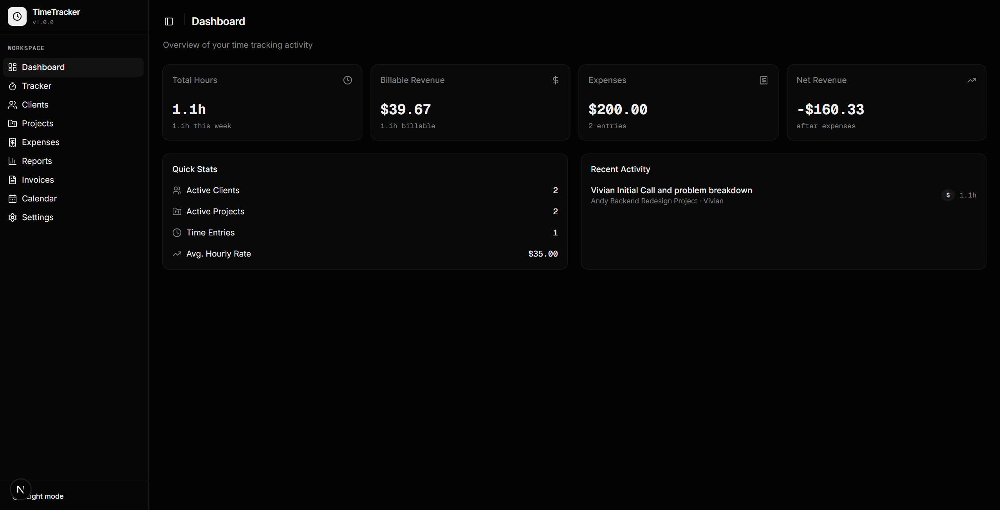
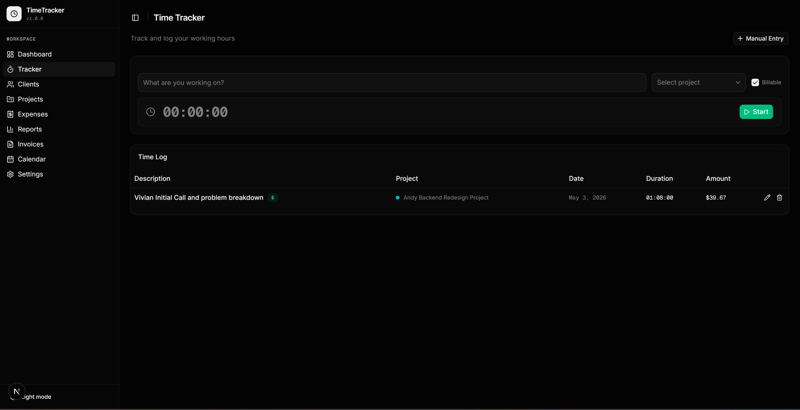
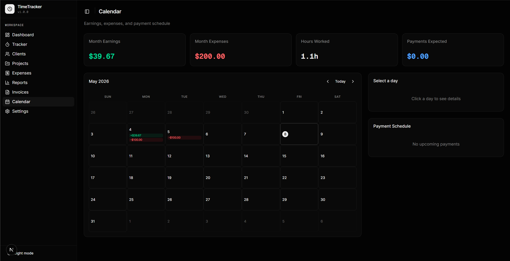
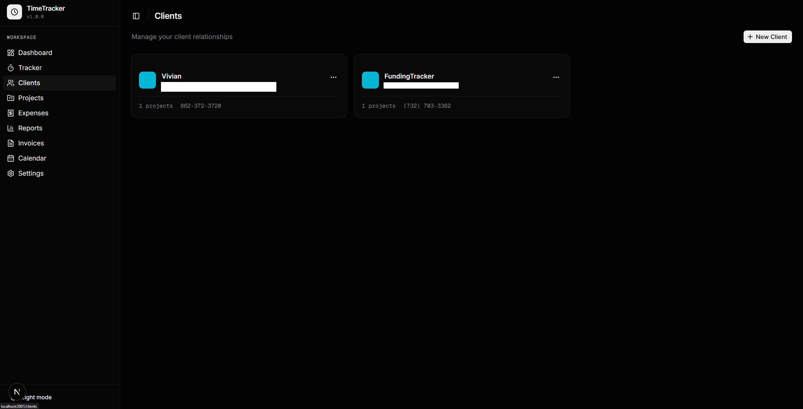
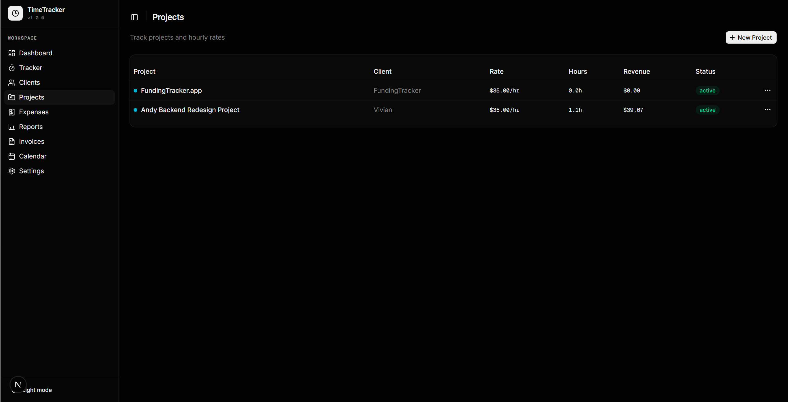
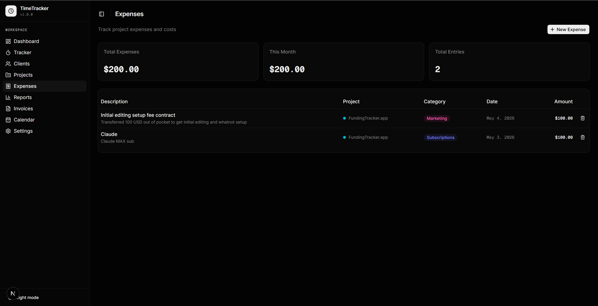
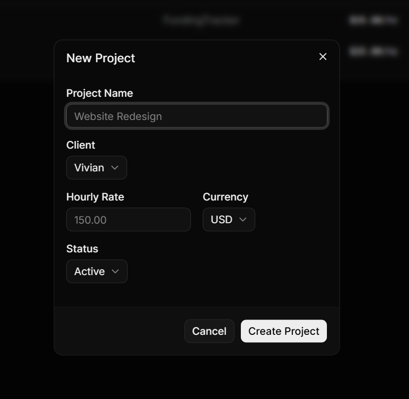
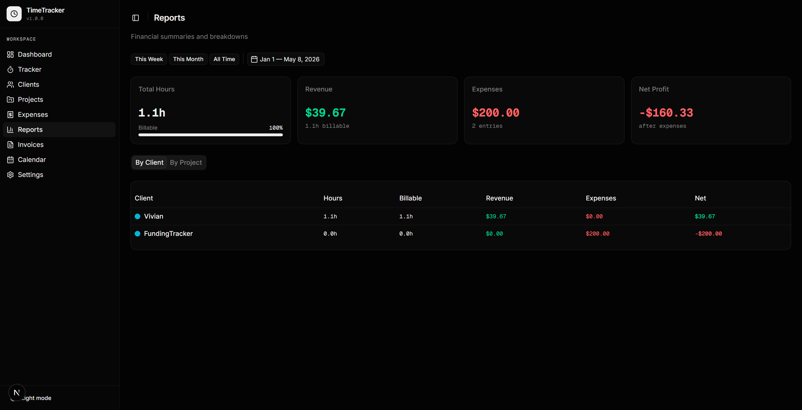

# TimeTracker

A self-hosted time tracking, invoicing, and expense management app built with Next.js, shadcn/ui, and Supabase.



## Features

- **Time Tracking** — Start/stop timer or manually log hours with per-project billable rates
- **Client Management** — Store client contact info, assign colors, and set automated invoice schedules
- **Project Management** — Create projects under clients with custom hourly rates and status tracking
- **Expense Tracking** — Log expenses by category with automatic invoice linking
- **Invoicing** — Generate invoices from tracked time and expenses, edit status/tax/notes, preview at PDF scale
- **Calendar View** — Monthly overview of earnings, expenses, and hours worked
- **Reports** — Filterable financial summaries broken down by client or project
- **Email Integration** — Send invoices via email using [Resend](https://resend.com)
- **Payout Threshold** — Set minimum payout amounts with currency selection
- **Dark Mode** — Full dark/light theme support





## Tech Stack

- [Next.js 16](https://nextjs.org) (App Router + Turbopack)
- [React 19](https://react.dev)
- [shadcn/ui v4](https://ui.shadcn.com) (Radix primitives + Tailwind CSS v4)
- [Supabase](https://supabase.com) (PostgreSQL)
- [Resend](https://resend.com) (transactional email — optional)
- [date-fns](https://date-fns.org) for date formatting
- [pnpm](https://pnpm.io) package manager

## Prerequisites

- [Node.js](https://nodejs.org) 18+
- [pnpm](https://pnpm.io) (`npm install -g pnpm`)
- A [Supabase](https://supabase.com) account (free tier works)

## Setup

### 1. Clone the repo

```bash
git clone https://github.com/your-username/timetracker.git
cd timetracker
```

### 2. Install dependencies

```bash
pnpm install
```

### 3. Create a Supabase project

1. Go to [supabase.com](https://supabase.com) and create a new project
2. Once your project is ready, go to **Settings > API** and copy your:
   - **Project URL** (looks like `https://abcdefg.supabase.co`)
   - **Anon public key** (starts with `eyJ...`)

### 4. Set up the database

**Option A — Supabase CLI (recommended)**

```bash
npx supabase login
npx supabase link --project-ref your-project-ref
npx supabase db push
```

Your project ref is the subdomain in your Supabase URL (e.g. `abcdefg` from `https://abcdefg.supabase.co`).

**Option B — SQL Editor**

1. Open your project in the [Supabase dashboard](https://supabase.com/dashboard)
2. Go to **SQL Editor** and click **New Query**
3. Copy the entire contents of [`supabase/setup.sql`](supabase/setup.sql) and paste it in
4. Click **Run** — this creates all tables, indexes, and RLS policies in one go

### 5. Configure environment variables

```bash
cp .env.example .env.local
```

Edit `.env.local` with your Supabase credentials:

```env
NEXT_PUBLIC_DB_PROVIDER=supabase
NEXT_PUBLIC_SUPABASE_URL=https://your-project.supabase.co
NEXT_PUBLIC_SUPABASE_ANON_KEY=your-anon-key
```

### 6. Start the dev server

```bash
pnpm dev
```

Open [http://localhost:3000](http://localhost:3000) in your browser.

## Email Setup (Optional)

To send invoices via email:

1. Create an account at [resend.com](https://resend.com)
2. Generate an API key (starts with `re_`)
3. Either add it to your `.env.local`:
   ```env
   RESEND_API_KEY=re_your_api_key
   ```
   Or enter it in the app under **Settings > Email Integration**

> You'll also need to verify a sending domain in Resend, or use their test domain for development.

## Screenshots

| | |
|---|---|
|  |  |
| **Dashboard** — Hours, revenue, expenses overview | **Tracker** — Timer and manual time entry |
|  |  |
| **Clients** — Contact info and project counts | **Projects** — Hourly rates and client assignment |
|  |  |
| **Expenses** — Categorized expense tracking | **New Project** — Project creation dialog |
|  |  |
| **Calendar** — Monthly earnings view | **Reports** — Financial breakdowns |

## Project Structure

```
timetracker/
├── app/                    # Next.js App Router pages
│   ├── api/                # API routes (Resend key, email sending)
│   ├── calendar/           # Calendar view
│   ├── clients/            # Client management
│   ├── expenses/           # Expense tracking
│   ├── invoices/           # Invoice generation and management
│   ├── projects/           # Project management
│   ├── reports/            # Financial reports
│   ├── settings/           # App settings and configuration
│   └── tracker/            # Time tracking
├── components/             # Reusable UI components
│   └── ui/                 # shadcn/ui primitives
├── lib/                    # Core utilities
│   ├── db/                 # Database providers (Supabase, future MariaDB)
│   ├── store.tsx           # React context state management
│   ├── types.ts            # TypeScript interfaces
│   └── format.ts           # Currency/number formatting
├── supabase/
│   └── migrations/         # SQL migration files
└── .env.example            # Environment variable template
```

## Database Abstraction

TimeTracker uses a `DataProvider` interface that abstracts all database operations. The current implementation uses Supabase (PostgreSQL), but the architecture supports swapping to any backend (MariaDB, SQLite, REST API) by implementing the same interface. See `lib/db/` for details.

## Building for Production

```bash
pnpm build
pnpm start
```

## License

This project is licensed under the [GNU General Public License v3.0](LICENSE) — you're free to use, modify, and distribute this software as long as you:

1. Give appropriate credit to the original author
2. Make your modified source code available under the same license
3. Include a copy of the license in any distribution
