# TimeTracker

A self-hosted time tracking, invoicing, and expense management app built with Next.js, shadcn/ui, and Supabase.

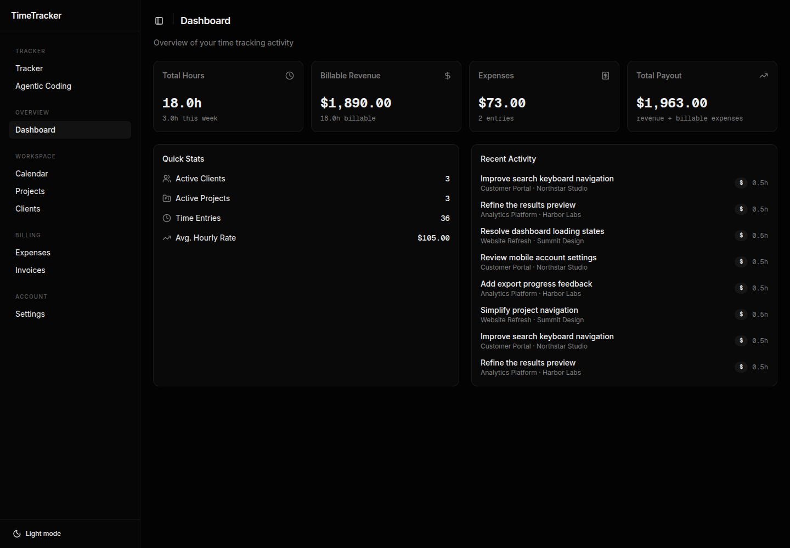

## Features

- **Agent Time imports** — Collect Claude, Codex, and T3 Code activity from multiple machines, map it to projects, and review imports before billing
- **Interval titles** — Choose a maximum entry length and generate a title from the chat messages in each interval
- **Machine and chat history** — Label computers and VMs, see each entry’s sources, and open dated transcripts from the description dropdown
- **Overlap review** — Exclude time already tracked or reserved by active timers and review conflicts in searchable dialogs
- **Time Tracking** — Start/stop timer or manually log hours with per-project billable rates
- **Client Management** — Store client contact info, assign colors, and set automated invoice schedules
- **Project Management** — Create projects under clients with custom hourly rates and status tracking
- **Expense Tracking** — Log expenses by category with automatic invoice linking
- **Invoicing** — Review automatic previews of unbilled time and expenses, create invoices, edit status/tax/notes, and preview or download PDFs
- **Calendar & Reports** — Monthly earnings, expenses, hours, and payment schedules with daily activity details
- **Email Integration** — Send invoices via email using [Resend](https://resend.com)
- **Payout Threshold** — Set minimum payout amounts with currency selection
- **Dark Mode** — Full dark/light theme support

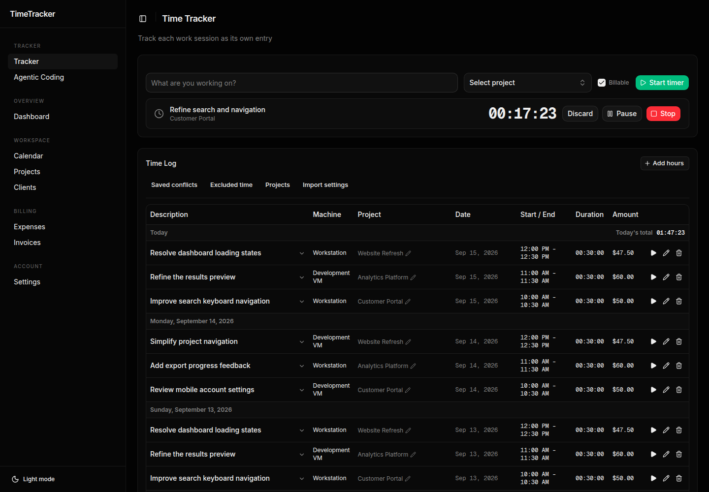

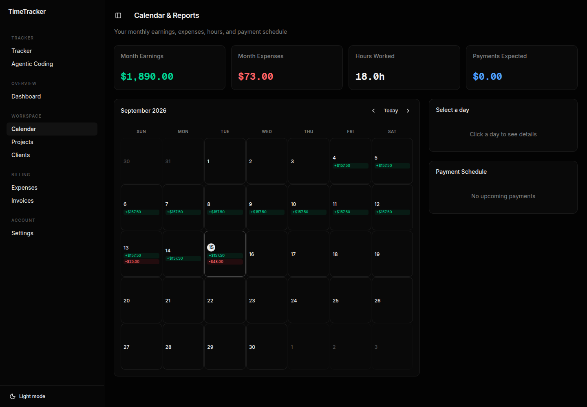

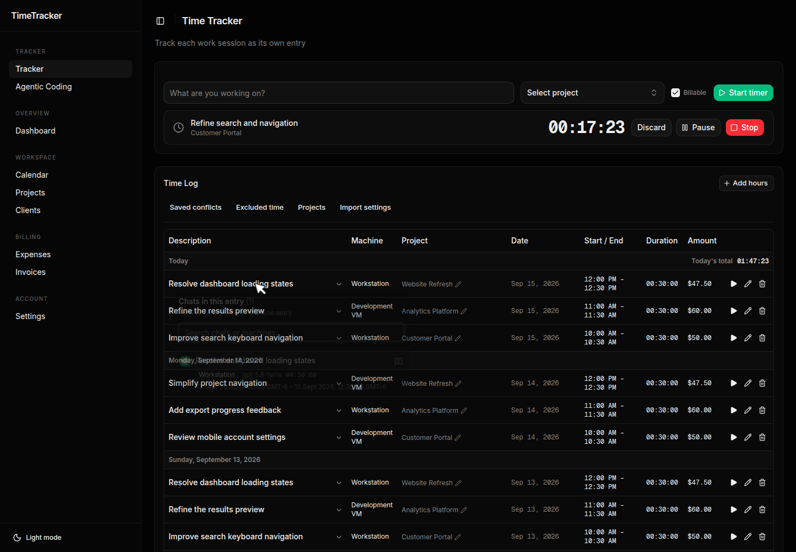

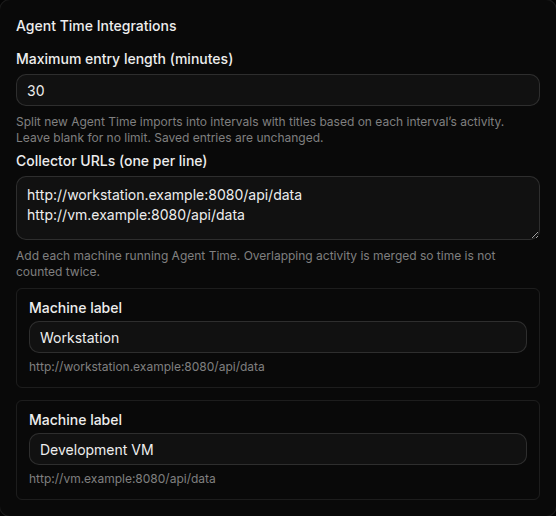

## Tech Stack

- [Next.js 16](https://nextjs.org) (App Router + Turbopack)
- [React 19](https://react.dev)
- [shadcn/ui v4](https://ui.shadcn.com) (Radix primitives + Tailwind CSS v4)
- [Supabase](https://supabase.com) (PostgreSQL)
- [Resend](https://resend.com) (transactional email — optional)
- [date-fns](https://date-fns.org) for date formatting
- [pnpm](https://pnpm.io) package manager

## Prerequisites

- [Node.js](https://nodejs.org) 22+
- [pnpm](https://pnpm.io) (`npm install -g pnpm`)
- A [Supabase](https://supabase.com) account (free tier works)

## Setup

### 1. Clone the repo

```bash
git clone https://github.com/AKolenda/timetracker.git
cd timetracker
```

### 2. Install dependencies

```bash
pnpm install
```

### 3. Create a Supabase project

1. Go to [supabase.com](https://supabase.com) and create a new project
2. Once your project is ready, go to **Settings > API** and copy your:
   - **Project URL** (looks like `https://abcdefg.supabase.co`)
   - **Anon public key** (starts with `eyJ...`)

### 4. Set up the database

**Option A — Supabase CLI (recommended)**

```bash
npx supabase login
npx supabase link --project-ref your-project-ref
npx supabase db push
```

Your project ref is the subdomain in your Supabase URL (e.g. `abcdefg` from `https://abcdefg.supabase.co`).

**Option B — SQL Editor**

1. Open your project in the [Supabase dashboard](https://supabase.com/dashboard)
2. Go to **SQL Editor** and click **New Query**
3. Copy the entire contents of [`supabase/setup.sql`](supabase/setup.sql) and paste it in
4. Click **Run** — this creates all tables, indexes, and RLS policies in one go

### 5. Configure environment variables

```bash
cp .env.example .env.local
```

Edit `.env.local` with your Supabase credentials:

```env
NEXT_PUBLIC_DB_PROVIDER=supabase
NEXT_PUBLIC_SUPABASE_URL=https://your-project.supabase.co
NEXT_PUBLIC_SUPABASE_ANON_KEY=your-anon-key
```

### 6. Start the dev server

```bash
pnpm dev
```

Open [http://localhost:3000](http://localhost:3000) in your browser.

## Email Setup (Optional)

To send invoices via email:

1. Create an account at [resend.com](https://resend.com)
2. Generate an API key (starts with `re_`)
3. Either add it to your `.env.local`:
   ```env
   RESEND_API_KEY=re_your_api_key
   ```
   Or enter it in the app under **Settings > Email Integration**

> You'll also need to verify a sending domain in Resend, or use their test domain for development.

## Screenshots

| | |
|---|---|
|  |  |
| **Dashboard** — Hours, revenue, expenses overview | **Tracker** — Timer and manual time entry |
| 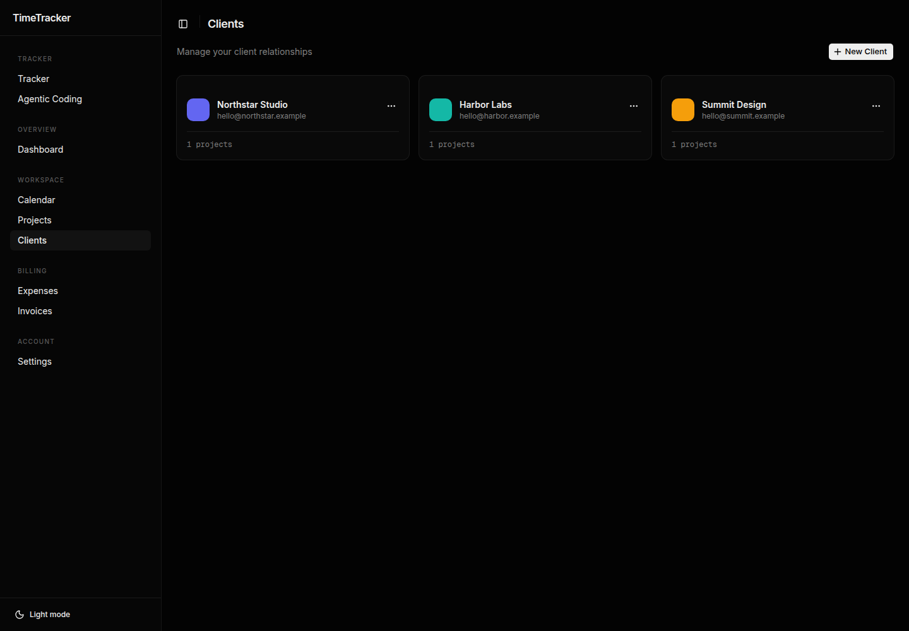 | 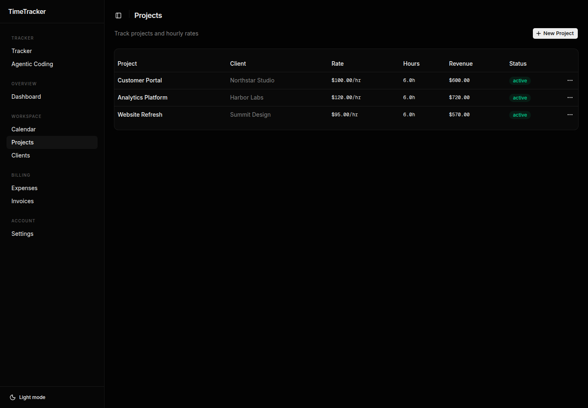 |
| **Clients** — Contact info and project counts | **Projects** — Hourly rates and client assignment |
| 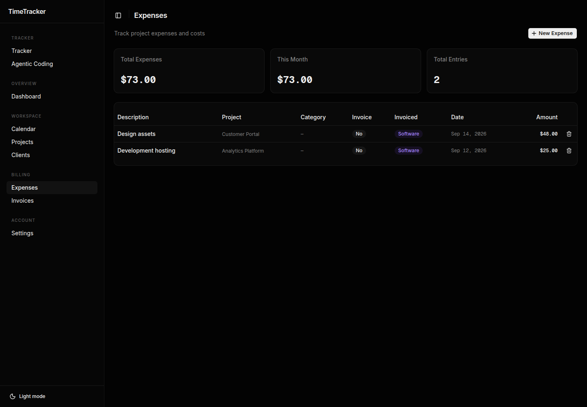 | 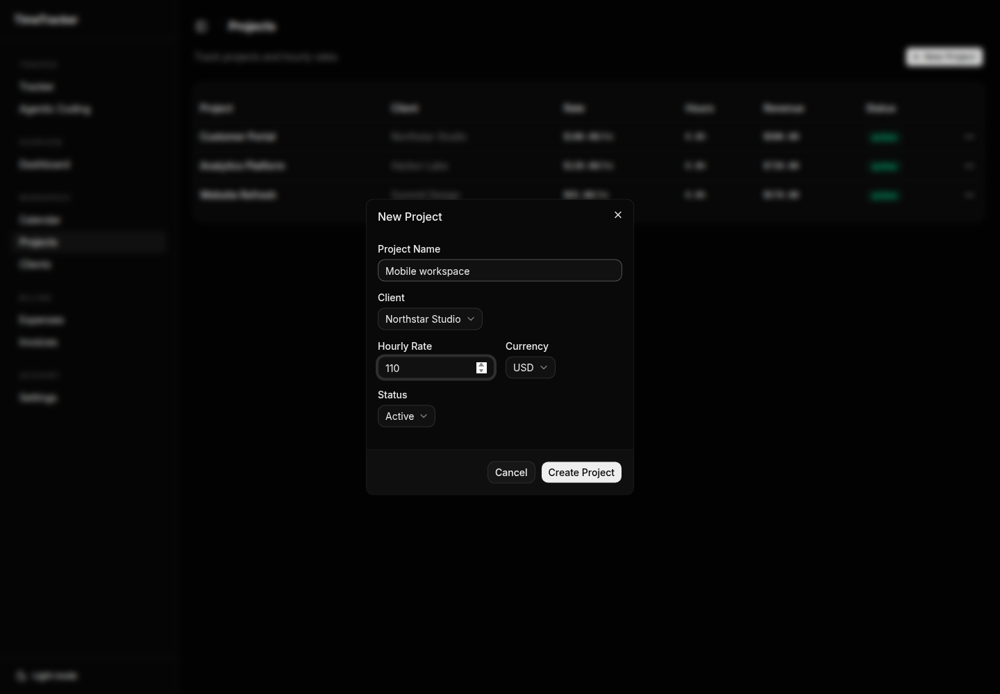 |
| **Expenses** — Categorized expense tracking | **New Project** — Project creation dialog |
|  |  |
| 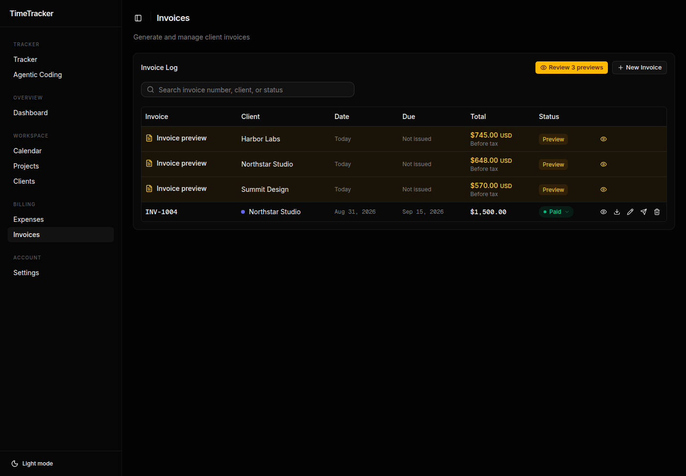 |  |
| **Calendar** — Monthly earnings view | **Reports** — Financial breakdowns |

## Project Structure

```
timetracker/
├── app/                    # Next.js App Router pages
│   ├── api/                # API routes (Resend key, email sending)
│   ├── calendar/           # Calendar view
│   ├── clients/            # Client management
│   ├── expenses/           # Expense tracking
│   ├── invoices/           # Invoice generation and management
│   ├── projects/           # Project management
│   ├── reports/            # Financial reports
│   ├── settings/           # App settings and configuration
│   └── tracker/            # Time tracking
├── components/             # Reusable UI components
│   └── ui/                 # shadcn/ui primitives
├── lib/                    # Core utilities
│   ├── db/                 # Database providers (Supabase, future MariaDB)
│   ├── store.tsx           # React context state management
│   ├── types.ts            # TypeScript interfaces
│   └── format.ts           # Currency/number formatting
├── supabase/
│   └── migrations/         # SQL migration files
└── .env.example            # Environment variable template
```

## Database Abstraction

TimeTracker uses a `DataProvider` interface that abstracts all database operations. The current implementation uses Supabase (PostgreSQL), but the architecture supports swapping to any backend (MariaDB, SQLite, REST API) by implementing the same interface. See `lib/db/` for details.

## Building for Production

```bash
pnpm build
pnpm start
```

## How Agent Time connects to TimeTracker

[Agent Time](https://github.com/AKolenda/agent-time) is the companion Python collector. Install it on every computer or VM where you code. TimeTracker is the web app that turns that activity into reviewed time entries, reports, and invoices.

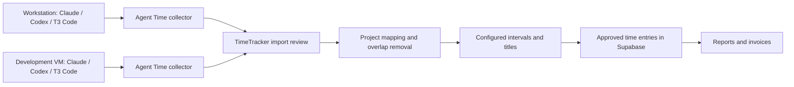
```mermaid
flowchart LR
  A[Workstation: Claude / Codex / T3 Code] --> B[Agent Time collector]
  C[Development VM: Claude / Codex / T3 Code] --> D[Agent Time collector]
  B --> E[TimeTracker import review]
  D --> E
  E --> F[Project mapping and overlap removal]
  F --> G[Configured intervals and titles]
  G --> H[Approved time entries in Supabase]
  H --> I[Reports and invoices]
```

### Connect your machines

1. Follow the [Agent Time installation guide](https://github.com/AKolenda/agent-time#readme) on each coding machine. Its example configuration binds to loopback; use that machine’s LAN address for remote imports.
2. Add the **TimeTracker server’s IP** to each collector’s `AGENT_TIME_TRUSTED_CLIENTS`, then restart its user service. The web server must be able to reach the collectors.
3. In **Settings → Agent Time Integrations**, add each collector URL, such as `http://workstation.example:8080/api/data`, and give it a label such as “Workstation” or “Development VM”. No machine is configured by default.
4. On **Tracker**, open **Projects** to map discovered workspace names to your billing projects. Review import settings and excluded time, then approve the entries you want to track.

Collector URLs may also be supplied through comma-separated `AGENT_TIME_REMOTE_URL` values on the TimeTracker server. URLs supplied to transcript requests must match configured collectors.

### Activity, intervals, and titles

Agent Time reads local provider logs and T3’s activity records. These are estimates of agent activity, so review them before billing. TimeTracker joins activity according to the import gap setting and removes periods already covered by saved entries or active timers for the same project.

Set **Maximum entry length (minutes)** in Settings to split new imports. It defaults to no limit. With a 30-minute limit, a 45-minute block becomes a 30-minute entry and a 15-minute entry. Each interval gets a title based on user/assistant messages timestamped inside that interval. Titles can be the same when the work has not changed. When no messages are available, the saved chat title is the fallback.

TimeTracker uses the Codex CLI on the **web server** for interval titles, defaulting to `gpt-5.6-terra` with low reasoning. Install and authenticate Codex under the user running TimeTracker and ensure `codex` is on that service’s `PATH`. `AGENT_SUMMARY_CODEX_MODEL` and `AGENT_SUMMARY_CODEX_EFFORT` override these choices. A generation failure leaves the draft available to retry. Agent Time’s own optional whole-chat summaries run separately under each collector’s user account.

The locally installed CLI may send prompt excerpts to its model provider; it does not mean inference runs offline. The collector’s transcript endpoint exposes chat text only to configured trusted clients. Keep collectors on a trusted network or VPN, and do not expose their plain HTTP ports to the public internet.

### Saved chats and machine attribution

The **Machine** column shows where activity came from; narrow screens show this below the description. Open an entry’s description dropdown to search its contributing chats and see their agent/model, machine, exact date/time, and duration. Select a chat to load its paginated transcript from its source machine.

T3 and native provider records merge only when the collector supplies their common `canonical_conversation_id` on the same machine. Their overlapping durations are counted once. Similar titles alone never cause chats to merge.

New approvals save chat references and clipped activity ranges in Supabase. Older entries may reconstruct references from available logs, which the dropdown labels accordingly. The original collector must be online to read message contents. Changing the interval setting does not rewrite saved entries or invoices; historical backfills are separate deployment-specific operations.

## Upgrading

Back up your database, then apply pending files in `supabase/migrations/` in order using the Supabase CLI or SQL editor before deploying the corresponding app version. Fresh installations can use `supabase/setup.sql`, which includes the same schema additions. For an existing database created manually, reconcile the CLI migration history before using `supabase db push`.

- `008_agent_time_hosts.sql`: multiple collector URLs.
- `009_agent_time_provenance.sql`: editable machine labels and saved chat references.
- `010_agent_time_intervals.sql`: optional maximum entry length.

Update Agent Time on each source machine too, then restart `systemctl --user restart agent-time`. Older collectors can still supply activity, but need current transcript and canonical-session support for chat viewing and duplicate merging. No personal URLs, labels, interval preferences, or historical backfills are seeded by the migrations.

### Reproducing the screenshots

The screenshots use fictional clients and activity. Run `pnpm test:mobile:fixture`, then open any app page at port 3100 with `?fixture=demo` (for example `/tracker?fixture=demo`). Fixture data is available only in builds with `NEXT_PUBLIC_E2E_FIXTURES=true`; it is not a production data seed. The mobile verification fixture remains `/tracker?fixture=mobile`.

## License

This project is licensed under the [GNU General Public License v3.0](LICENSE) — you're free to use, modify, and distribute this software as long as you:

1. Give appropriate credit to the original author
2. Make your modified source code available under the same license
3. Include a copy of the license in any distribution

